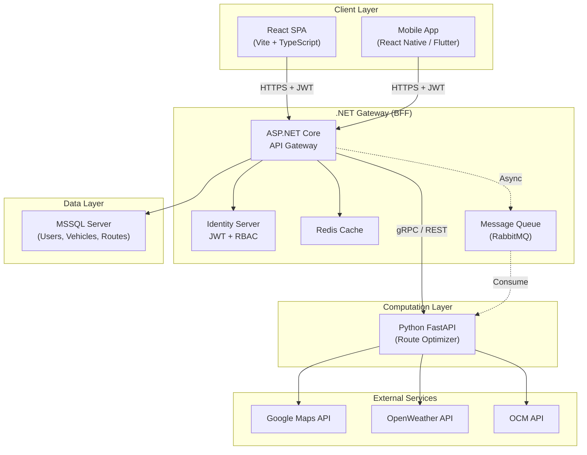
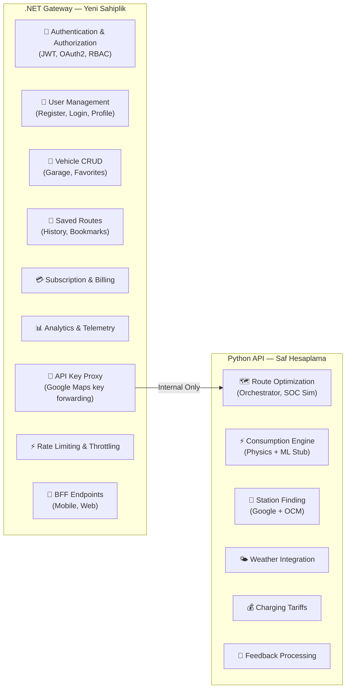
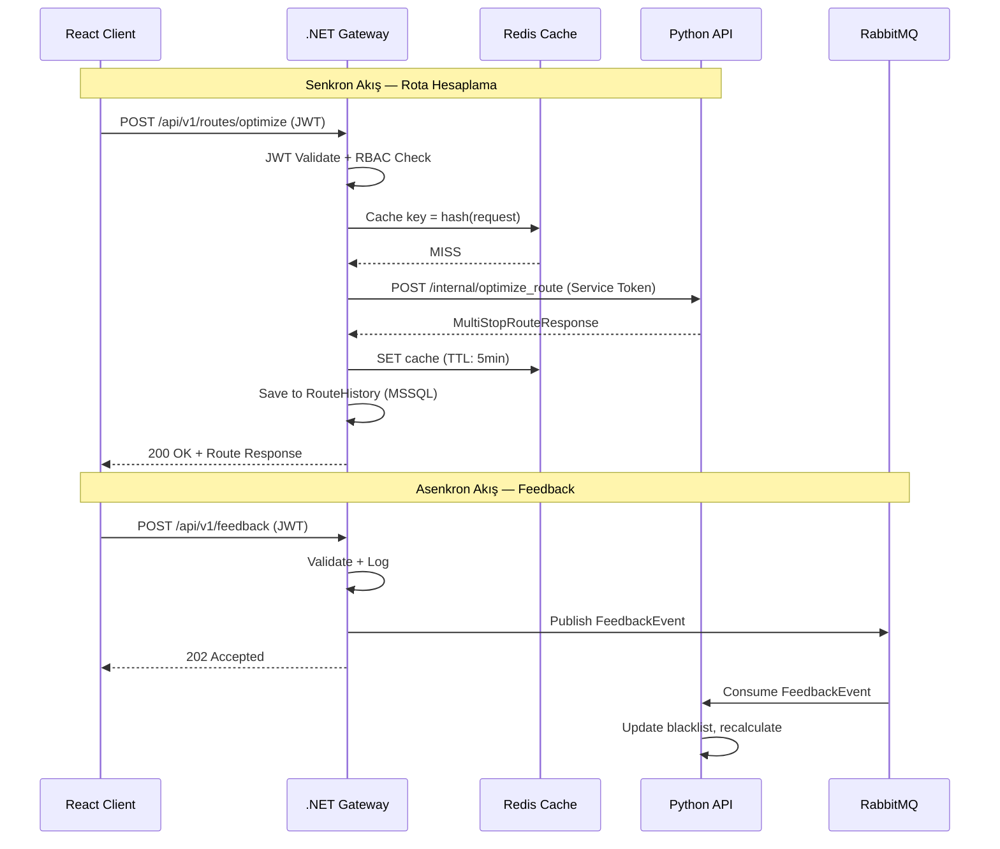
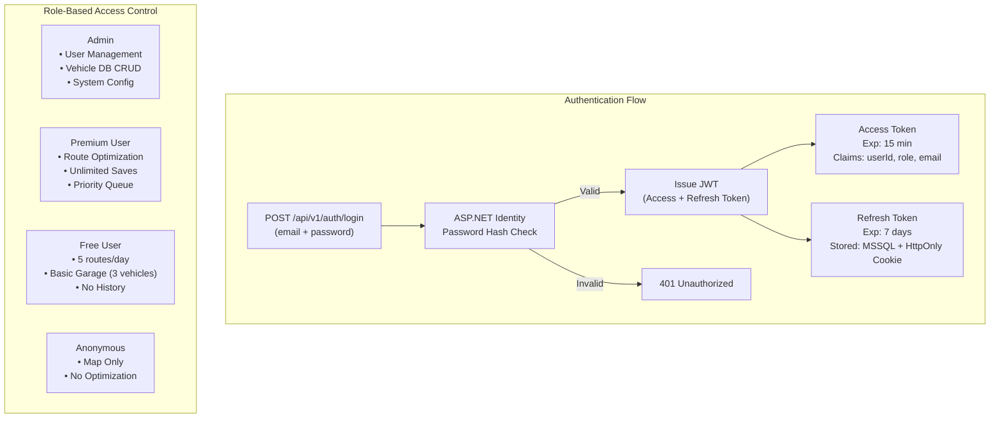
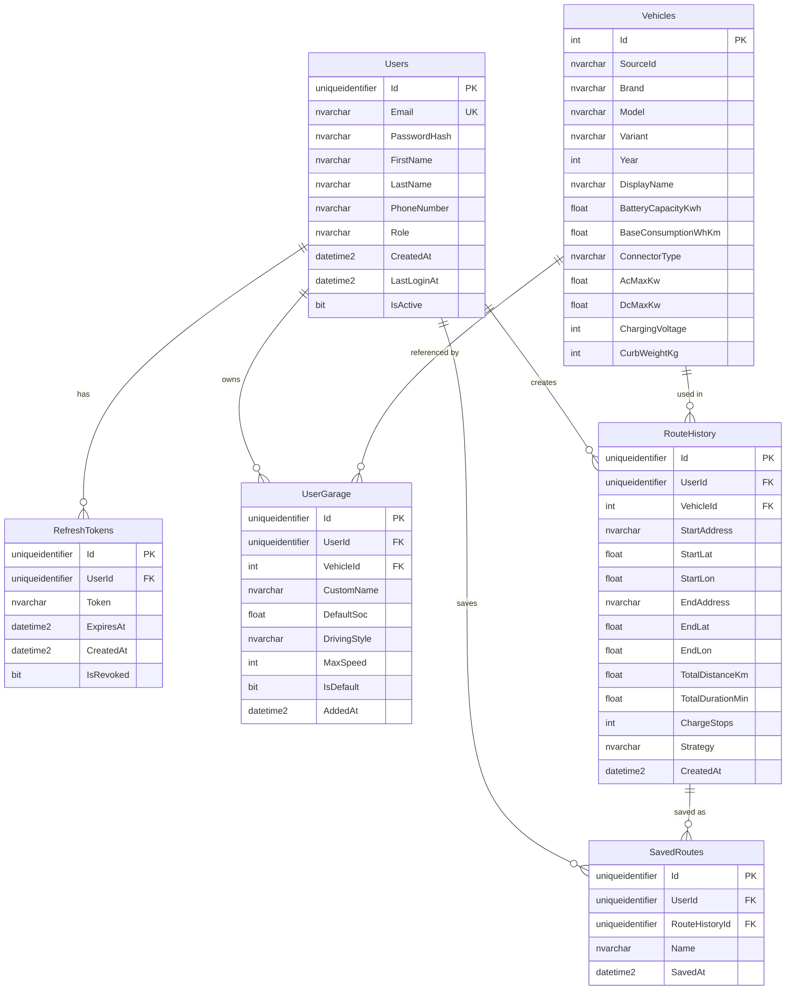
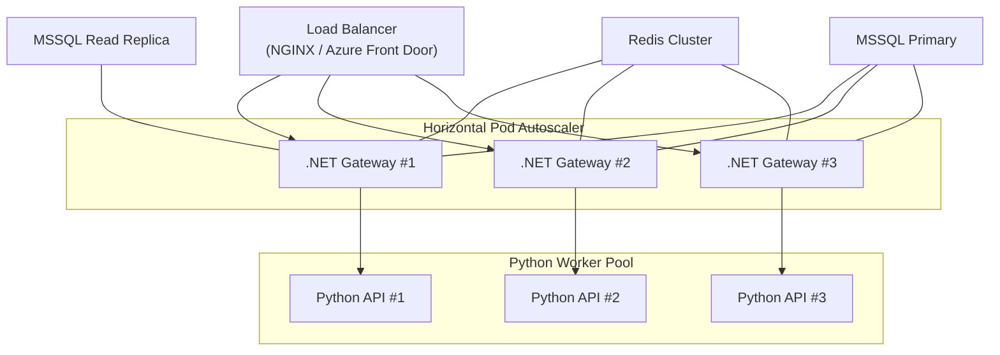

# 🏗️ EV Route Optimizer — Production-Ready Mimari Dönüşüm Blueprint'i

> **Tarih:** 2026-03-20  
> **Versiyon:** v1.0  
> **Durum:** İnceleme Bekliyor  

---

## I. MİMARİ GENEL BAKIŞ



---

## II. MEVCUT YAPININ ANALİZİ (Hard Critique)

### A. FastAPI Backend — Kritik Tespitler

| Dosya / Modül | Tespit | Şiddet |
|---|---|---|
| [main.py](file:///c:/Ev-Route-Optimizer-Api/app/main.py) (815 satır) | **God Object Anti-Pattern.** Tek dosyada 15+ endpoint, helper'lar, tüm route definition'lar, inline import'lar (satır 592, 616). Bu dosya SRP'yi ihlal ediyor. | 🔴 Kritik |
| [main.py#L92-L103](file:///c:/Ev-Route-Optimizer-Api/app/main.py#L92-L103) | **CORS `allow_origins=["*"]`** debug modunda. Production flag'i `config.is_debug()` ile kontrol ediliyor ama `.env` dosyasında `DEBUG=true` kalırsa production'da da `*` aktif olur. Hardcoded production domain'ler placeholder. | 🔴 Kritik |
| [main.py#L162-L168](file:///c:/Ev-Route-Optimizer-Api/app/main.py#L162-L168) | **`/api/maps-key` endpoint'i Google API key'i düz metin olarak expose ediyor.** Herhangi bir auth olmadan erişilebilir. Bu key ile potansiyel olarak sınırsız Google API çağrısı yapılabilir. | 🔴 Kritik |
| [main.py#L224-L348](file:///c:/Ev-Route-Optimizer-Api/app/main.py#L224-L348) | **Endpoint'te iş mantığı.** `optimize_route` fonksiyonu içinde validation, logging, error handling ve debug bilgisi enjeksiyonu iç içe. Controller/Service ayrımı yok. | 🟡 Yüksek |
| [main.py#L233](file:///c:/Ev-Route-Optimizer-Api/app/main.py#L233) | **Request ID üretimi:** `f"req_{int(request_start_time * 1000)}"` — milisaniye timestamp. Eşzamanlı isteklerde çakışma riski var. `uuid4()` kullanılmalı. | 🟡 Yüksek |
| [models.py](file:///c:/Ev-Route-Optimizer-Api/app/models.py) (479 satır) | **Monolitik model dosyası.** 9 farklı domain concern'ünü (Enums, GeoPoint, Station, Vehicle, Weather, Preferences, Legs, Response, Feedback) tek dosyada barındırıyor. Domain Separation yok. | 🟡 Yüksek |
| [models.py#L148-L158](file:///c:/Ev-Route-Optimizer-Api/app/models.py#L148-L158) | **Zombie Model.** `VehicleModel` (basit BaseModel) vs `VehicleSpec` (detaylı dataclass) — iki farklı araç modeli birlikte yaşıyor. `VehicleModel` kullanılmıyor ama silinmemiş. Confusion riski. | 🟡 Orta |
| [route_planner.py](file:///c:/Ev-Route-Optimizer-Api/app/route_planner.py) | **Backward Compatibility Proxy.** Tüm mantık `route_planning/orchestrator`'a taşınmış ama eski dosya duruyor. Temiz değil ama tehlike oluşturmuyor. | 🟢 Düşük |
| [requirements.txt](file:///c:/Ev-Route-Optimizer-Api/requirements.txt) | **Pinlenmemiş dependency'ler.** `fastapi>=0.104.0` gibi açık version range'ler. Production'da reproducible build garanti edilmiyor. `pip freeze > requirements.lock` stratejisi yok. | 🟡 Yüksek |
| Genel | **Rate limiting yok.** Tüm endpoint'ler sınırsız çağrılabilir. DDoS veya API key abuse'a tamamen açık. | 🔴 Kritik |
| Genel | **Auth katmanı sıfır.** API'ye herhangi bir authentication/authorization mekanizması ekli değil. `/optimize_route` dahil tüm endpoint'ler anonim erişime açık. | 🔴 Kritik |

### B. React Frontend — Kritik Tespitler

| Dosya / Modül | Tespit | Şiddet |
|---|---|---|
| [AuthContext.tsx](file:///c:/Ev_Route_Optimizer_Web/src/contexts/AuthContext.tsx) | **`currentUser: any` tipi.** TypeScript kullanılıyor ama auth state tamamen `any`. User interface tanımlanmamış. Type safety sıfır. | 🔴 Kritik |
| [useAuthForm.ts](file:///c:/Ev_Route_Optimizer_Web/src/hooks/useAuthForm.ts#L4-L10) | **Hardcoded `MOCK_USER`.** Şifre `"1234"`, email `"admin@iyontree.com"`. Hiçbir backend çağrısı yok. Production'da bu kod canlı kalırsa kritik güvenlik açığı. | 🔴 Kritik |
| [useAuthForm.ts#L84](file:///c:/Ev_Route_Optimizer_Web/src/hooks/useAuthForm.ts#L84) | **Client-side password check:** `password === MOCK_USER.password`. Auth tamamen client-side. Token yok, session yok, JWT yok. | 🔴 Kritik |
| [VehicleContext.tsx](file:///c:/Ev_Route_Optimizer_Web/src/contexts/VehicleContext.tsx) | **Tüm araç verileri `localStorage`'da.** Kullanıcı cache temizlerse tüm garaj verileri kaybolur. Cihazlar arası sync yok. 5MB localStorage limiti riski. | 🔴 Kritik |
| [vehicle.ts](file:///c:/Ev_Route_Optimizer_Web/src/types/vehicle.ts) | **Frontend Vehicle tipi vs Backend `VehicleSpec` uyumsuzluğu.** Frontend'de `brand`, `model`, `customName`, `soc` var. Backend'de `display_name`, `battery_capacity_kwh`, `base_consumption_wh_km` var. Alan isimleri tamamen farklı. | 🟡 Yüksek |
| [App.tsx#L46](file:///c:/Ev_Route_Optimizer_Web/src/App.tsx#L46) | **Google Maps API key `import.meta.env` ile expose ediliyor.** `.env` dosyasında `VITE_GOOGLE_MAPS_API_KEY` tutuluyor — build sonrası bundle'da düz metin olarak okunabilir. | 🟡 Yüksek |
| [Sidebar.tsx](file:///c:/Ev_Route_Optimizer_Web/src/components/Sidebar.tsx) | **Location state yönetimi component-local.** `locations` state'i Sidebar içinde. Rota hesaplama tetiklendiğinde bu veri nasıl API'ye gidiyor? Prop drilling ile mi? Global state'te olmalı. | 🟡 Yüksek |
| [Sidebar.tsx#L257](file:///c:/Ev_Route_Optimizer_Web/src/components/Sidebar.tsx#L257) | **`alert()` kullanımı.** "Kayıtlı Rotalar" için `alert()` çağrısı. Placeholder ama production'da izin verilmemeli. | 🟢 Düşük |
| Genel | **API service layer yok.** Backend çağrıları component'ler içinde dağınık. Merkezi bir `apiClient` veya `fetch wrapper` bulunmuyor. .NET Gateway'e geçişte her component'te URL değişikliği gerekecek. | 🟡 Yüksek |
| Genel | **`@tanstack/react-query` dependency'de var ama kullanılmıyor.** Kurulu ama hiçbir `useQuery`/`useMutation` çağrısı yok. | 🟢 Düşük |

---

## III. ÜÇ KATMANLI MİMARİ PLANI

### A. Sorumluluk Dağılımı



### B. Taşınması Gereken İşlemler

| Mevcut Konum | Hedef Konum | İş | Neden |
|---|---|---|---|
| Python `/api/maps-key` | .NET Gateway | Google Maps API key proxy | Key exposure'ı önlemek, rate limiting eklemek |
| Python `/vehicles/*` | .NET Gateway | Araç katalog CRUD | MSSQL'e taşınacak, user-vehicle ilişkisi kurulacak |
| Python `/geocode`, `/autocomplete` | .NET Gateway | Geocoding proxy | Auth + rate limiting gerekliliği |
| Frontend `localStorage` | .NET + MSSQL | Kullanıcı garaj verileri | Kalıcı depolama, cihazlar arası sync |
| Frontend `MOCK_USER` | .NET Identity | Auth mantığı | Gerçek auth altyapısı |
| Python `/optimize_route` | Python'da kalır | Rota hesaplama | Hesaplama yoğun, Python ekosistemi uygun |
| Python `/station_feedback`, `/switch_station` | Python'da kalır | Feedback & recalculate | Rota motoru ile tight coupling gerekli |
| Python `/api/map_stations` | Python'da kalır | Harita istasyonları | Google Places API ile doğrudan entegrasyon |

### C. Inter-Service Communication

> [!IMPORTANT]
> .NET ↔ Python iletişiminde **Hybrid yaklaşım** öneriyorum: **Senkron → REST/gRPC, Asenkron → Message Queue.**



#### Protokol Kararı

| Senaryo | Protokol | Gerekçe |
|---|---|---|
| Rota hesaplama (senkron) | **gRPC** (tercih) veya REST | Binary serialization, ~10x daha düşük latency, streaming desteği. Python'da `grpcio` mature. |
| Feedback & async ops | **RabbitMQ** | Fire-and-forget, retry mekanizması, dead-letter queue desteği. Kullanıcıyı bekletmeme. |
| Araç kataloğu (fallback) | **REST** | Basit CRUD, gRPC overkill. Cache ile desteklenir. |

> [!WARNING]
> gRPC seçilirse `.proto` dosyaları her iki proje tarafından paylaşılmalı. NuGet/PyPI private package veya Git submodule ile senkronize edilmeli. **Version mismatch = Runtime crash.**

### D. Security Layer — JWT + RBAC



**JWT Payload Yapısı:**
```json
{
  "sub": "user-uuid-here",
  "email": "user@example.com",
  "role": "premium",
  "permissions": ["route:optimize", "garage:write", "history:read"],
  "iat": 1742496000,
  "exp": 1742496900,
  "iss": "iyontree-gateway",
  "aud": "iyontree-client"
}
```

**Uygulama Detayları:**

1. **ASP.NET Core Identity** kullanılacak — `UserManager<AppUser>`, `RoleManager<IdentityRole>`
2. **Password hashing:** Argon2id (IdentityV3 default BCrypt yerine, OWASP 2025 recommendation)
3. **Refresh token rotation:** Her kullanımda eski token revoke, yeni token issue
4. **Token blacklist:** Redis'te revoke edilmiş token'lar (logout, password change)
5. **Service-to-service auth:** .NET → Python iletişiminde API Key veya mTLS. JWT değil.

---

## IV. MSSQL & DATA MANAGEMENT

### A. Veritabanı Şeması



### B. Repository Pattern & Unit of Work

```
Gateway.Infrastructure/
├── Data/
│   ├── AppDbContext.cs                 # EF Core DbContext
│   └── Configurations/
│       ├── UserConfiguration.cs        # Fluent API — Users tablosu
│       ├── VehicleConfiguration.cs
│       ├── UserGarageConfiguration.cs
│       └── RouteHistoryConfiguration.cs
├── Repositories/
│   ├── IRepository<T>.cs              # Generic interface
│   ├── Repository<T>.cs               # Base implementation
│   ├── IUserRepository.cs             # User-specific queries
│   ├── UserRepository.cs
│   ├── IVehicleRepository.cs
│   ├── VehicleRepository.cs
│   ├── IGarageRepository.cs
│   └── GarageRepository.cs
└── UnitOfWork/
    ├── IUnitOfWork.cs
    └── UnitOfWork.cs
```

**`IUnitOfWork` Pattern:**
```csharp
public interface IUnitOfWork : IDisposable
{
    IUserRepository Users { get; }
    IVehicleRepository Vehicles { get; }
    IGarageRepository Garages { get; }
    IRouteHistoryRepository RouteHistory { get; }
    
    Task<int> SaveChangesAsync(CancellationToken ct = default);
    Task BeginTransactionAsync();
    Task CommitTransactionAsync();
    Task RollbackTransactionAsync();
}
```

### C. Cache Stratejisi (Redis)

| Veri | Cache Key Pattern | TTL | Invalidation |
|---|---|---|---|
| Araç kataloğu | `vehicles:all`, `vehicles:brand:{name}` | 24 saat | Admin araç güncellemesinde |
| Rota sonucu | `route:{hash(request)}` | 5 dakika | Yok (doğal expire) |
| Kullanıcı garajı | `garage:{userId}` | 1 saat | CRUD işleminde |
| Google Maps key | `config:maps_key` | 12 saat | Admin değişikliğinde |
| Rate limit counter | `ratelimit:{userId}:{endpoint}` | Sliding window | Otomatik |
| Revoked tokens | `blacklist:token:{jti}` | Token exp süresi kadar | Otomatik |

> [!TIP]
> **Cache-Aside Pattern** kullanılacak: Önce Redis oku → miss ise MSSQL'den çek → Redis'e yaz → response dön. `IDistributedCache` interface'i ile abstract edilecek.

---

## V. MOBİL & ÖLÇEKLENEBİLİRLİK

### A. API Versiyonlama & DTO Tasarımı

**URL-based versioning:**
```
/api/v1/auth/login
/api/v1/routes/optimize
/api/v1/garage/vehicles
/api/v2/routes/optimize   ← Gelecek: ML-powered
```

**DTO Katmanı:**
```
Gateway.Application/
├── DTOs/
│   ├── Auth/
│   │   ├── LoginRequestDto.cs
│   │   ├── LoginResponseDto.cs
│   │   ├── RegisterRequestDto.cs
│   │   └── RefreshTokenRequestDto.cs
│   ├── Vehicles/
│   │   ├── VehicleSummaryDto.cs      # Liste görünümü (az alan)
│   │   ├── VehicleDetailDto.cs       # Detay görünümü (tüm alanlar)
│   │   └── GarageItemDto.cs          # Kullanıcı garajı
│   └── Routes/
│       ├── RouteOptimizeRequestDto.cs
│       ├── RouteOptimizeResponseDto.cs
│       └── RouteHistoryDto.cs
```

> [!IMPORTANT]
> **BFF (Backend for Frontend) prensibi:** Web ve Mobile için farklı response DTO'ları olabilir. Mobile'da bandwidth kısıtlı — `VehicleSummaryDto` 5 alan, `VehicleDetailDto` 20+ alan. Controller seviyesinde `Accept: application/vnd.iyontree.mobile+json` header ile ayrıştırılabilir.

### B. Ölçeklendirme Stratejisi



| Darboğaz | Çözüm | Metrik Hedefi |
|---|---|---|
| Python API (CPU-bound hesaplama) | **Horizontal scaling** — Aynı anda N instance. Stateless tasarım. Gunicorn/Uvicorn worker pool. | p99 < 3 saniye |
| MSSQL (yüksek okuma) | **Read replica** + Redis cache. Araç kataloğu ve kullanıcı garajı read-heavy. | Cache hit > 90% |
| .NET Gateway (I/O-bound orchestration) | **Horizontal scaling** — Stateless, JWT ile session-free. | p99 < 200ms (proxy overhead) |
| Google Maps API (external limit) | **Request coalescing** + cache. Aynı geocode sorgusu 1 kez. | API call reduction > 60% |

---

## VI. TESPİT EDİLEN KRİTİK RİSKLER

| # | Risk | Etki | Olasılık | Azaltma Stratejisi |
|---|---|---|---|---|
| R1 | **Google API key exposure** (`/api/maps-key` + frontend env) | Finansal hasar (sınırsız API call) | Yüksek | .NET proxy + key restriction (HTTP referrer, IP whitelist) |
| R2 | **Sıfır authentication** | Tüm endpointlar anonim erişime açık | Kesin | .NET Identity + JWT (Faz 1 öncelik) |
| R3 | **CORS wildcard** production'da | CSRF, data theft | Orta | .NET seviyesinde strict origin policy |
| R4 | **localStorage veri kaybı** | Kullanıcı garaj verileri silinebilir | Yüksek | MSSQL'e taşıma + sync mekanizması |
| R5 | **Rate limiting yokluğu** | DDoS, API abuse | Yüksek | ASP.NET Rate Limiting middleware (sliding window) |
| R6 | **Pinlenmemiş Python dependency'ler** | Reproducibility sorunu, breaking change | Orta | `pip-tools` ile `requirements.lock` |
| R7 | **Monolitik `main.py`** | Bakım zorluğu, merge conflict | Orta | Router ayrımı (blueprint pattern) |
| R8 | **Service-to-service auth yok** | Python API'ye doğrudan erişim | Yüksek | mTLS veya shared API key + network isolation |
| R9 | **Frontend-Backend type mismatch** | Runtime hataları, veri kaybı | Orta | Shared DTO contract (OpenAPI spec) |

---

## VII. ADIM ADIM ENTEGRASYON PLANI

### Faz 0 — Hazırlık (Gün 1-2)

- [ ] .NET solution oluşturma (Clean Architecture: `API`, `Application`, `Domain`, `Infrastructure`)
- [ ] MSSQL veritabanı kurulumu + EF Core migration altyapısı
- [ ] Redis instance kurulumu (local Docker veya Azure Cache)
- [ ] Python API endpoint'lerini `/internal/` prefix'ine taşıma
- [ ] Python API'ye service-token validation middleware ekleme

### Faz 1 — Auth & Identity (Gün 3-5)

- [ ] ASP.NET Core Identity + `AppUser` entity
- [ ] JWT token generation (Access + Refresh)
- [ ] Login / Register / Refresh / Logout endpoint'leri
- [ ] RBAC: Role seeding (Admin, Premium, Free)
- [ ] React `AuthContext` refactor — JWT token management
- [ ] React `useAuthForm` — backend entegrasyonu (mock kaldırılır)

### Faz 2 — API Gateway & Proxying (Gün 6-8)

- [ ] .NET `/api/v1/routes/optimize` → Python `/internal/optimize_route` proxy
- [ ] .NET `/api/v1/maps-key` → Google API key proxy (auth required)
- [ ] .NET `/api/v1/geocode` ve `/api/v1/autocomplete` proxy
- [ ] .NET `/api/v1/stations` proxy
- [ ] React API base URL değişikliği → tüm trafik .NET üzerinden
- [ ] React `apiClient.ts` oluşturma — centralized fetch wrapper with JWT injection

### Faz 3 — Data Migration & CRUD (Gün 9-12)

- [ ] MSSQL: Users, Vehicles, UserGarage, RouteHistory tabloları
- [ ] `vehicles.json` → MSSQL migration script
- [ ] .NET Vehicle CRUD endpoint'leri (brands, search, detail)
- [ ] .NET Garage CRUD endpoint'leri (add, remove, set default)
- [ ] React `VehicleContext` refactor — localStorage → API calls
- [ ] Route History save/list endpoint'leri

### Faz 4 — Cache & Performance (Gün 13-14)

- [ ] Redis cache integration (IDistributedCache)
- [ ] Vehicle catalog cache (24h TTL)
- [ ] Route result cache (5min TTL)
- [ ] Rate limiting middleware (AspNetCoreRateLimit)
- [ ] Request/Response logging middleware
- [ ] Health check endpoint'leri (.NET + Python aggregated)

### Faz 5 — Mobile Readiness & Polish (Gün 15-17)

- [ ] API versioning setup (URL-based v1)
- [ ] BFF DTO separation (web vs mobile)
- [ ] Swagger/OpenAPI documentation
- [ ] CORS strict policy (production domains)
- [ ] Error response standardization (RFC 7807 Problem Details)
- [ ] Integration tests (xUnit + WebApplicationFactory)

### Faz 6 — Python API Hardening (Gün 18-19)

- [ ] `main.py` refactor — APIRouter ayrımı
- [ ] `models.py` split — domain-based modules
- [ ] `requirements.lock` oluşturma
- [ ] Internal-only middleware (reject external requests)
- [ ] Structured error responses (standardize with .NET)

### Faz 7 — Deployment & Monitoring (Gün 20)

- [ ] Docker Compose (Gateway + Python + MSSQL + Redis)
- [ ] Health check + readiness probe
- [ ] Serilog + Seq veya Application Insights
- [ ] CI/CD pipeline tanımı

---

## VIII. KOD STANDARTLARI VE İYİLEŞTİRMELER

### .NET Gateway Standartları

| Konu | Standart |
|---|---|
| **Architecture** | Clean Architecture (Entities → Use Cases → Interface Adapters → Frameworks) |
| **Naming** | PascalCase (classes, methods), camelCase (local variables), `I` prefix (interfaces) |
| **Async** | Tüm I/O operasyonları `async/await`. `Task.Run()` yasak (thread pool abuse). |
| **Validation** | FluentValidation — her request DTO için validator class |
| **Mapping** | AutoMapper veya Mapster — Entity ↔ DTO dönüşümü |
| **Logging** | Serilog structured logging. `ILogger<T>` injection. |
| **Error Handling** | Global exception middleware + RFC 7807 ProblemDetails |
| **DI** | Constructor injection only. Service lifetime: Scoped (default), Singleton (config), Transient (lightweight) |

### Python API İyileştirmeleri

| Konu | Mevcut | Önerilen |
|---|---|---|
| **Router yapısı** | Tümü `main.py`'de | `APIRouter` ile ayrım: `routes/`, `vehicles/`, `stations/`, `feedback/` |
| **Model ayrımı** | Tek `models.py` | `models/enums.py`, `models/geo.py`, `models/station.py`, `models/route.py`, `models/feedback.py` |
| **Request ID** | Timestamp-based | `uuid4()` veya `ulid` |
| **Dependencies** | Openrange (`>=`) | `pip-tools` → `requirements.in` + `requirements.txt` (locked) |
| **Internal guard** | Yok | `X-Internal-Service-Token` header middleware |
| **Dead code** | `VehicleModel` (line 148-158) | Kaldır |

### React Frontend İyileştirmeleri

| Konu | Mevcut | Önerilen |
|---|---|---|
| **API Client** | Component-level fetch | `src/lib/apiClient.ts` — Centralized Axios/fetch wrapper |
| **Auth Types** | `any` | `src/types/auth.ts` → `User`, `AuthState`, `LoginRequest` interfaces |
| **State** | localStorage | Backend-synced via `@tanstack/react-query` (zaten dependency'de) |
| **API Calls** | Inline | `src/hooks/useRouteOptimize.ts`, `src/hooks/useVehicles.ts` — react-query hooks |
| **Error Handling** | `alert()` | Toast notification component (sonner veya react-hot-toast) |
| **Environment** | `VITE_GOOGLE_MAPS_API_KEY` exposed | .NET proxy endpoint'ten key al, bundle'dan kaldır |

---

## IX. SONUÇ

Bu platform, güçlü bir hesaplama motoru (`consumption_engine`, `soc_simulator`, `station_finder`) ve sağlam bir Pydantic model yapısı üzerine inşa edilmiş. Ancak **güvenlik katmanı tamamen eksik**, **veri kalıcılığı client-side** ve **monolitik yapı bakım risklerini artırıyor**.

.NET Gateway katmanı bu üç kritik açığı kapatırken, Python API'yi **saf bir hesaplama mikroservisi** olarak izole eder. Bu ayrım:

1. **Güvenlik sorumluluğunu merkezileştirir** — Tek bir JWT issuer, tek bir RBAC engine, tek bir rate limiter
2. **Veri bütünlüğünü garanti eder** — MSSQL + EF Core + Migration = schema-first development
3. **Mobil hazırlığı sağlar** — BFF pattern ile platform-agnostic API
4. **Bağımsız ölçeklenmeyi mümkün kılar** — .NET I/O-bound, Python CPU-bound → farklı scaling stratejileri
